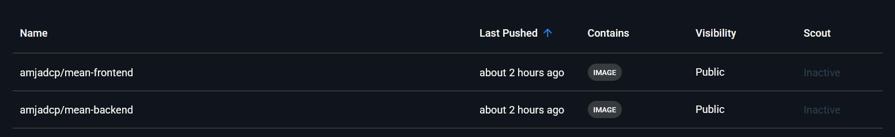
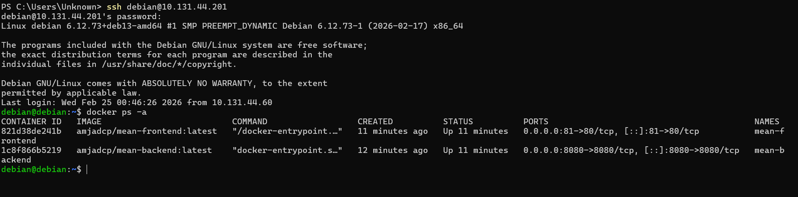
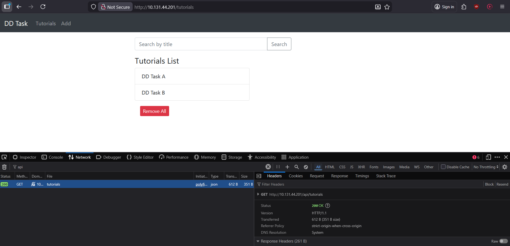

# 🚀 MEAN Stack Deployment with CI/CD

> A full-stack MEAN (MongoDB, Express, Angular, Node.js) application deployed using Docker containers, Nginx reverse proxy, and automated CI/CD with GitHub Actions (Self-Hosted Runner).

---

# 📌 Project Objective

Design and deploy a infrastructure that:

* Containerizes backend and database
* Uses reverse proxy architecture
* Implements CI/CD automation
* Automatically deploys updates on code push
* Follows real-world DevOps practices

---

# ⚠️ Infrastructure Constraint & Engineering Decision

The original requirement was to deploy on an Ubuntu VM in a cloud provider.

Due to bank account restrictions, I was unable to create an account in any cloud platform.

### 💡 Engineering Solution

Instead of blocking the implementation:

* Created a **Debian Virtual Machine** using VirtualBox
* Enabled **Bridged Network Adapter**
* Accessed the VM via **SSH**
    `ssh debian@VM_LAN_IP`
* Used it as a production-like server

This approach replicates:

* Cloud VM networking
* Remote SSH deployment
* Server-level Nginx configuration
* Real-world infrastructure separation

---

# 🏗️ Final Architecture

```text
Developer Push → GitHub
        ↓
GitHub Actions (Build & Push Images)
        ↓
Docker Hub Registry
        ↓
Self-Hosted Runner (Debian VM)
        ↓
docker-compose pull & restart
        ↓
Nginx (Host Machine)
        ↓
Frontend + Backend Containers
        ↓
MongoDB Container (Persistent Volume)
```

---

# 🧱 Tech Stack

| Layer            | Technology                           |
| ---------------- | ------------------------------------ |
| Frontend         | Angular                              |
| Backend          | ExpressJS (Node.js)                  |
| Database         | MongoDB (Official Docker Image)      |
| Containerization | Docker                               |
| Orchestration    | Docker Compose                       |
| Reverse Proxy    | Nginx (Host-installed)               |
| CI/CD            | GitHub Actions                       |
| Deployment       | Self-Hosted GitHub Runner            |
| Server           | Debian VM (VirtualBox, Bridged Mode) |

---

# 🔧 Code Adaptations for Containerization

To support Docker networking and reverse proxy routing, two changes were made.

---

## 1️⃣ MongoDB Connection Update

**File:**
`backend/app/config/db.config.js`

### Before

```js
mongodb://localhost:27017/dd_db
```

### After

```js
mongodb://host.docker.internal:27017/dd_db
```

### Why?

Inside Docker, localhost means the container itself, NOT host machine. 

---

## 2️⃣ Frontend API Base URL Update

**File:**
`frontend/src/app/services/tutorial.service.ts`

### Before

```ts
http://localhost:8080/api/tutorials
```

### After

```ts
http://10.131.44.201/api/tutorials
```

### Why?

Since Nginx is acting as the reverse proxy on port 80, the frontend must route API calls through the proxy rather than directly to the backend container.

This mirrors production routing behavior.

---

# 🐳 Containerization Strategy

## Backend Dockerfile

```dockerfile
FROM node:20-alpine
WORKDIR /app
COPY package*.json ./
RUN npm install
COPY . .
EXPOSE 8080
CMD ["node", "server.js"]
```

---

## Frontend Dockerfile

```dockerfile
# Build Angular
FROM node:20-alpine AS build
WORKDIR /app
COPY package*.json ./
RUN npm ci
COPY . .
RUN npm run build

# Serve with Nginx
FROM nginx:alpine
COPY --from=build /app/dist/angular-15-crud /usr/share/nginx/html
EXPOSE 80
CMD ["nginx", "-g", "daemon off;"]
```

---

# 🧩 Docker Compose Setup

```yaml
version: '3.8'

services:

  backend:
    image: amjadcp/mean-backend:latest
    extra_hosts:
      - "host.docker.internal:host-gateway"
    container_name: mean-backend
    restart: always
    ports:
      - "8080:8080"

  frontend:
    image: amjadcp/mean-frontend:latest
    container_name: mean-frontend
    restart: always
    depends_on:
      - backend
    ports:
      - "81:80"
```

---

# 🌐 Nginx Reverse Proxy (Host-Level)

Installed directly on Debian VM:

```bash
sudo apt install nginx
```

Configuration:

```nginx
server {
    listen 80;
    server_name 10.131.44.201;

    location /api/ {
        proxy_pass http://localhost:8080;
        proxy_set_header Host $host;
        proxy_set_header X-Real-IP $remote_addr;
        proxy_set_header X-Forwarded-For $proxy_add_x_forwarded_for;
    }

    location / {
        proxy_pass http://localhost:81;
        proxy_set_header Host $host;
        proxy_set_header X-Real-IP $remote_addr;
        proxy_set_header X-Forwarded-For $proxy_add_x_forwarded_for;
    }
}
```

### Why Host-Level Nginx?

* Cleaner separation of concerns
* SSL termination ready
* Easier infrastructure scaling

---

# 🔄 CI/CD Pipeline

## Pipeline Behavior

On every push to `production`:

1. Build backend Docker image
2. Build frontend Docker image
3. Push images to Docker Hub
4. Self-hosted runner pulls latest images
5. Restart containers via Docker Compose

---

## GitHub Actions Workflow

```yaml
name: Build and Deploy to Production

on:
  push:
    branches:
      - production

jobs:

  build:
    runs-on: ubuntu-latest
    steps:
      - name: Checkout Code
        uses: actions/checkout@v4

      - name: Login to Docker Hub
        uses: docker/login-action@v3
        with:
          username: ${{ secrets.DOCKERHUB_USERNAME }}
          password: ${{ secrets.DOCKERHUB_TOKEN }}

      - name: Build and Push Backend
        uses: docker/build-push-action@v5
        with:
          context: ./backend
          push: true
          tags: ${{ secrets.DOCKERHUB_USERNAME }}/mean-backend:latest

      - name: Build and Push Frontend
        uses: docker/build-push-action@v5
        with:
          context: ./frontend
          push: true
          tags: ${{ secrets.DOCKERHUB_USERNAME }}/mean-frontend:latest

  deploy:
    needs: build
    runs-on: self-hosted
    steps:
      - name: Deploy Containers
        run: |
          cd /home/debian/mean-app
          docker-compose pull
          docker-compose up -d
```

---

# 📸 Screenshots

### 1️⃣ CI/CD Pipeline Success


---

### 2️⃣ Docker Hub Image Push



---

### 3️⃣ Running Containers on VM



---

### 4️⃣ Application UI



---

# 🎯 Engineering Highlights

✔ Infrastructure replication without cloud
✔ Container networking adaptation
✔ Reverse proxy configuration
✔ CI/CD automation
✔ Self-hosted deployment strategy
✔ Persistent database volume
✔ Multi-stage Docker builds

---

# 📈 What This Demonstrates

This project reflects:

* DevOps workflow design
* Docker production practices
* CI/CD pipeline implementation
* Reverse proxy architecture
* Container-based deployment
* Infrastructure troubleshooting & adaptation

---

# 👨‍💻 Author

[**Amjad C P**](https://dev.to/amjadcp/)
